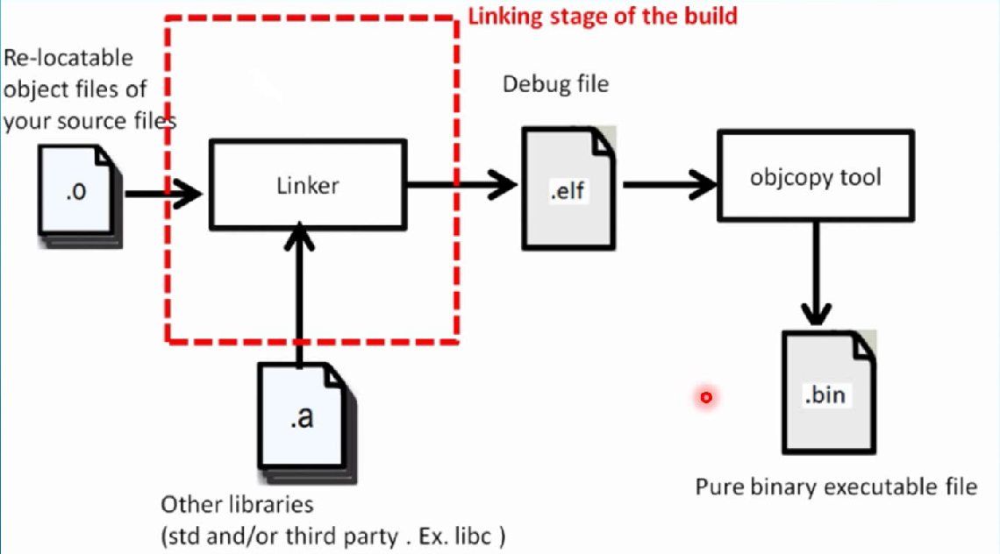

The source code structure of a typical embedded project is shown as follows:
```css
project/
├── src/
│   ├── main.c
│   ├── uart.c
│   ├── gpio.c
│   └── isr.c
├── inc/
│   ├── uart.h
│   ├── gpio.h
│   └── device.h
├── startup/
│   └── startup.s
├── linker/
│   └── linker.ld
├── Makefile / CMakeLists.txt
└── build/
```
# Preprocessing
```bash
arm-none-eabi-gcc -E main.c
```
What happens:
- #include expansion
- #define macro replacement
- #if / #ifdef conditional compilation
- Comments removed
- Line markers (#line) added


Output: **.i file** for every .c file. 

The size of .i file is **much bigger** than .c file because we have all header files included and all macros expanded.

# Compilation
```bash
arm-none-eabi-gcc -c main.c
arm-none-eabi-gcc -save-temps -c main.c  # save the middle files like .i .s
```

What happens:
- C → Assembly → Object file (.o)
- No linking yet
- Translate into machine code based on the **instruction set**.
- Generated code depends on the **processor type, architecture and optimization level**.

## Parsing
- parse .i files
- syntax checking and report errors
- build an Abstract Syntax Tree (**AST**)

## Semantic analysis
- analyze AST and resolve identifiers
- build symbol tables
- check types
- check lvalues, conversions, qualifiers, etc.

## Code Generation
turns the analyzed C program into actual machine code or assembly
- instruction selection
```c
// c
a = b + c;
// ARM
ADD r0, r1, r2
```
- register allocation
- address calculation
- calling convention handling(parameter passing and return value handling of functions)
- control flow generation
- data layout(correct alignment, padding, ABI compliance)

Output: **.s files**

## Assembly
converts human-readable assembly instructions into **machine code** and produces **object files**.
```bash
arm-none-eabi-gcc -c startup.s
```
What happens:  
- Instruction encoding
```c
// ARM
ADD r0, r1, r2
// machine code
0xE0800002   (example)
```

- Symbol resolution (local)  
(1) Calculates offsets for local jumps  
(2) Marks unresolved external symbols for the linker


- Section creation

| Section   | Purpose          |
| :-------: | :--------------: |
| `.text`   | Code             |
| `.data`   | Initialized data |
| `.bss`    | Zero-init data   |
| `.rodata` | Constants        |
| `.heap`   | Heap             |
| `.stack`  | Stack            |


Output: **main.o, uart.o, gpio.o**

# Linking(very important!)
Combines all object files into one executable **.elf file**(debugging)
```bash
arm-none-eabi-gcc \
  main.o uart.o gpio.o startup.o \
  -T linker.ld \
  -o firmware.elf
```

## Symbol resolution
Matches **function and variable** references to their definitions

Example: 
```c
extern int counter;
```
is resolved to the actual `counter` definition somewhere else

If a symbol is missing → **linker error**(undefined reference to `counter`)

## Section merging
Each `.o` file contains sections like:
- `.text` → code
- `.rodata` → const data
- `.data` → initialized globals
- `.bss` → uninitialized globals

The linker **merges same-type sections**:
```markdown
.text (file1) + .text (file2) → final .text
```

## Memory placement
Unlike PC programs, **embedded systems have fixed memory**:
| Memory | Typical use       |
| ------ | ----------------- |
| Flash  | code, const       |
| RAM    | stack, heap, data |
The linker decides:
- `.text` → Flash (0x08000000)
- `.data` → RAM (0x20000000)
- `.bss` → RAM
- stack / heap → RAM

This is controlled by the **linker script**.

**Role of the linker script (linker.ld)**  
Embedded systems have no OS to load programs.

The linker must:
- Decide exact addresses
- Map sections to Flash / RAM

Example:
```c
MEMORY
{
  FLASH (rx) : ORIGIN = 0x08000000, LENGTH = 512K
  RAM   (rwx): ORIGIN = 0x20000000, LENGTH = 128K
}
```

## Relocation
Fix up addresses in compiled code and data once the linker knows the final memory layout

= **replace placeholders with real addresses**

When a compiler builds a `.o` file, it **does not know**:
- where the function will live in Flash
- where globals will end up in RAM
- how far away other functions are

So it generates:
- **symbol references** (not real addresses)
- **relocation entries** that say what needs to be fixed later

Example:

Source code:
```c
extern int counter;

void inc(void) {
    counter++;
}
```
What the compiler emits (conceptually):
```bash
ldr r0, =counter   ; address unknown → placeholder
ldr r1, [r0]
add r1, r1, #1
str r1, [r0]
```
But `=counter` is **not an address yet**.

The object file contains:
- a symbol: `counter`
- a relocation record: “At offset X, insert address of `counter`”

**What the linker does**
- Places sections:
```bash
counter → RAM @ 0x20000010
inc()   → Flash @ 0x08000400
```
- Applies relocations:
```bash
replace placeholder with 0x20000010
```

Now the instruction is correct.


## Library selection & dead-code elimination
- Pulls in only **used functions** from **static libraries** (`.a`)
- Can remove unused code with:
```text
-ffunction-sections -fdata-sections
-Wl,--gc-sections
```



The linker does **NOT** blindly include the entire library.
It extracts only the object files that **satisfy unresolved symbols**.

### How the linker decides what to include
A static library is basically:
```text
libfoo.a
 ├── foo1.o
 ├── foo2.o
 ├── foo3.o
```
Each `.o` contains:
- some functions
- some global variables
- its own `.text`, `.data`, `.bss`


(1) Linker starts with your application object files:
```bash
main.o, driver.o, utils.o
```

(2) It looks for **undefined symbols**:
```c
printf();
uart_init();
```

(3) When it sees a static library (`libfoo.a`):
- It scans the library **object by object**
- If `foo2.o` defines a needed symbol → **include foo2.o**
- If `foo1.o` defines nothing needed → **skip it**

**Only the needed `.o` files are pulled in**

Example:

Library code:
```c
// libmath.c
int add(int a, int b) { return a + b; }
int sub(int a, int b) { return a - b; }
int mul(int a, int b) { return a * b; }
```
Compiled as:
```bash
libmath.a → libmath.o
```
Your code
```c
int main(void) {
    return add(2, 3);
}
```
Because all functions are in one `.o`, the linker pulls:
```bash
add + sub + mul   ❌ Not ideal for embedded flash size.
```

Now compile the library like this:
```bash
gcc -ffunction-sections -fdata-sections
```
Each function goes into its own section:
```bash
.text.add
.text.sub
.text.mul
```
Then link with:
```bash
-Wl,--gc-sections
```
Now the linker can:
- Pull in `libmath.o`
- **Throw away unused sections** (`sub`, `mul`)

✅ Final binary contains only `add`


## A `.elf` file usually includes:
- Executable code (machine instructions)
- All data sections (global/static variables)
- Exact memory addresses
- Symbol table (functions, variables)
- Relocation info (sometimes)
- Debug information (if built with -g)
- Section & program headers

# Post-processing(optional)
- object copy
- produce .hex or .bin files for release<br>

# Startup code execution (runtime init)
After reset:  
(1) CPU jumps to reset vector  
(2) Startup code:  
- Sets stack pointer
- Copies `.data` from Flash → RAM
- Clears `.bss`

(3) Calls main()


## Embedded-specific differences from PC builds
| PC program              | Embedded firmware  |
| ----------------------- | ------------------ |
| OS loader               | Startup code       |
| Virtual memory          | Physical addresses |
| Dynamic linking         | Static linking     |
| malloc always available | Optional           |
| Filesystem              | Often none         |
